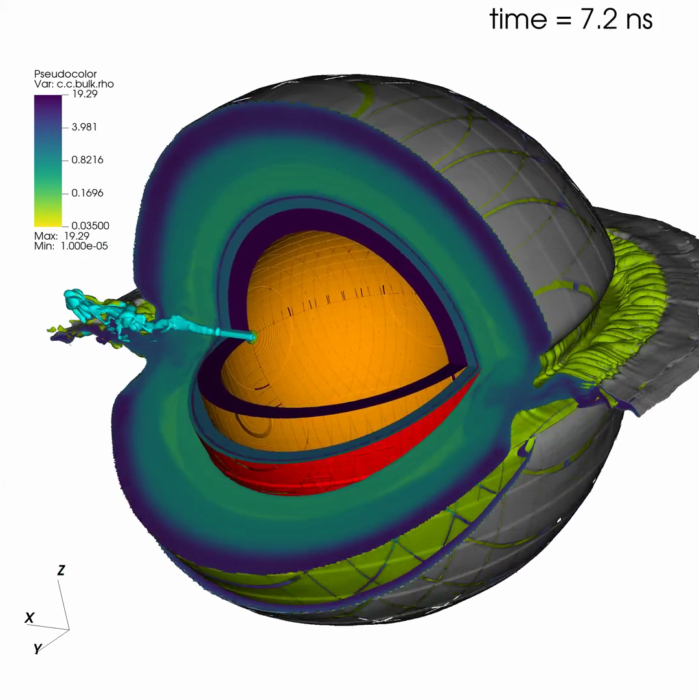

.. figure:: ../../riot_logo.png
   :alt: The riot logo
   :align: left
   :width: 800px

block-adaptive, performance portable mutli-material radiation hydrodynamics
==================================================================================

Performance portable equations of state and mixed cell closures.

.. include:: src/introduction.rst
   :start-line: 4

.. toctree::
   :maxdepth: 1
   :caption: Contents:

   src/building
   src/packages/materials
   src/packages/hydro
   src/packages/strength
   src/packages/ionization
   src/packages/laser
   src/packages/levelsets
   src/packages/scalars
   src/packages/gravity
   src/packages/prescribed_sources
   src/packages/tracers
   src/packages/mix
   src/packages/radiation_transport
   src/packages/radiation_diffusion
   src/packages/tnburn
   src/packages/sparse_physics
   src/packages/regions
   src/packages/python_interface
   src/programmer_guide
   src/packages/diagnostics
   src/contributing

Indices and tables
==================

* :ref:`genindex`
* :ref:`modindex`
* :ref:`search`

.. include:: src/acknowledgements.rst
